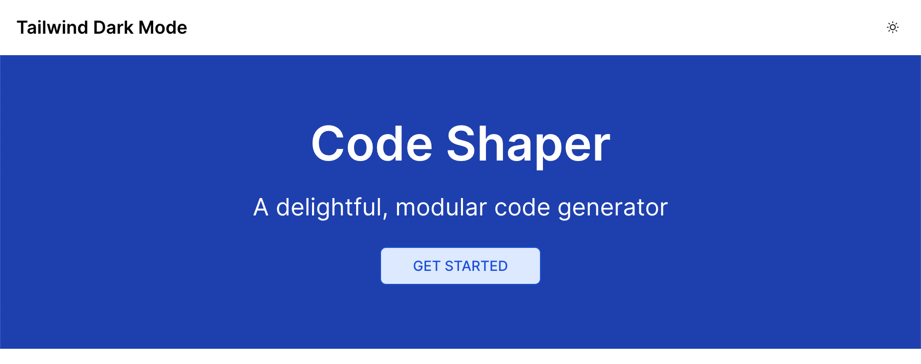
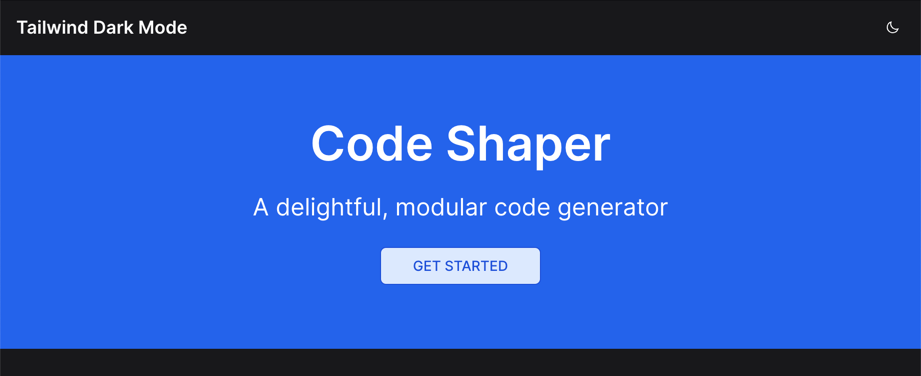

# Tailwind Dark Mode using semantic colors

Demo of implementing dark mode using Tailwind CSS. This version uses semantic
color tokens, e.g. `bg-default` instead of `bg-white` and `dark:bg-neutral-900`.





## Development Build

```shell
# Run ci in the root directory to install dependencies
npm ci

# Run the app
npm run dev
```

Now point your browser to http://localhost:3000

### Production Build

```shell
npm run build
npm start
```
